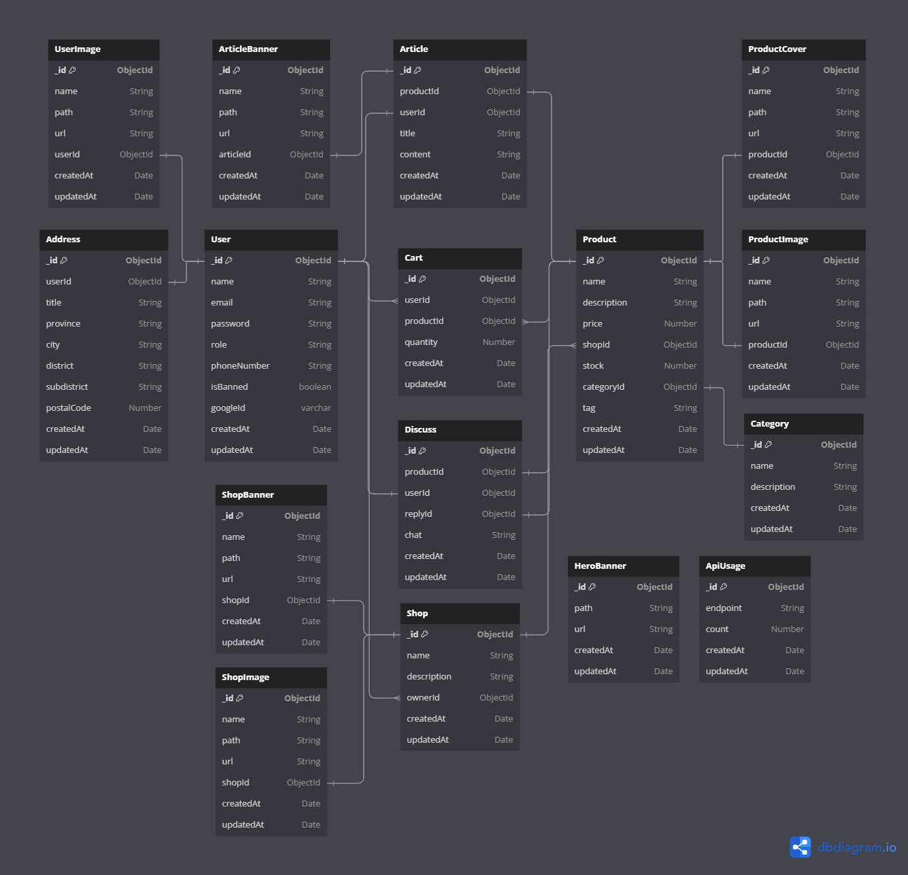

Current Database Schema



```
pusatoleholeh-backend-tim
├─ .git
│  ├─ COMMIT_EDITMSG
│  ├─ config
│  ├─ description
│  ├─ FETCH_HEAD
│  ├─ HEAD
│  ├─ hooks
│  │  ├─ applypatch-msg.sample
│  │  ├─ commit-msg.sample
│  │  ├─ fsmonitor-watchman.sample
│  │  ├─ post-update.sample
│  │  ├─ pre-applypatch.sample
│  │  ├─ pre-commit.sample
│  │  ├─ pre-merge-commit.sample
│  │  ├─ pre-push.sample
│  │  ├─ pre-rebase.sample
│  │  ├─ pre-receive.sample
│  │  ├─ prepare-commit-msg.sample
│  │  ├─ sendemail-validate.sample
│  │  └─ update.sample
│  ├─ index
│  ├─ info
│  │  └─ exclude
│  ├─ objects
│  │  ├─ 02
│  │  │  └─ 42c23cee2c17c4b56a86a0ec0c6ffbd9d82e84
│  │  ├─ 06
│  │  │  └─ 079bd201eb34dbb62ae664da40d970b9137727
│  │  ├─ 0e
│  │  │  └─ 0b36754bcceb8b1bedaec9dfaa436686086695
│  │  ├─ 11
│  │  │  └─ c330b199f1a044d935eb2ad62056e9a4628d22
│  │  ├─ 16
│  │  │  └─ 595548489e6d7dd7077fd97a36f329d7b9bed5
│  │  ├─ 1d
│  │  │  └─ ca9a14bb9342ca603d2c6acd3d619c7e750a49
│  │  ├─ 20
│  │  │  └─ a7f23c06a10f6537f782eb0743b5063ac5fbe3
│  │  ├─ 22
│  │  │  └─ 4806c84461904db753a21f2b6b380bb2db29d4
│  │  ├─ 23
│  │  │  └─ 44fd05c24843f637f541adfb88e78dc8273bb9
│  │  ├─ 24
│  │  │  ├─ 7a5ae9b2b8b9d9bd8d806339d18bc0b8dfbfab
│  │  │  └─ f78b33f316091e50133301965e0c7e183ec3bc
│  │  ├─ 29
│  │  │  └─ 4eaf35557736b74a9fa20c0fb6906eb2d9baca
│  │  ├─ 2b
│  │  │  └─ dccc1eff0135589c3848db810c20679871f16a
│  │  ├─ 2c
│  │  │  └─ e68a6f22407e733ae46c21b8832e545aa1cba6
│  │  ├─ 2e
│  │  │  └─ 84ee7111502fb470b4d4253cdeac0879d4f6f7
│  │  ├─ 31
│  │  │  └─ 1ea657bb6d6c0ceee26172686c132eabba41cf
│  │  ├─ 35
│  │  │  └─ 24caf322b7ded268e5e2437e6e562a9ed24adc
│  │  ├─ 38
│  │  │  └─ 14de71025d80f4d06e15ba23fde674586fc273
│  │  ├─ 45
│  │  │  └─ a9670ff2e9de31ce400f12b29d015941013c62
│  │  ├─ 53
│  │  │  └─ 714d1101f7a412515abf1d0c29ceb0c70164bb
│  │  ├─ 54
│  │  │  ├─ 84ba2fc81a9ae2560bc69fffeeda09b3c7818d
│  │  │  └─ e6668d66309d345ab8d871ca8dcb7d4f2abe1f
│  │  ├─ 56
│  │  │  └─ d39960b1aaae2e7644cdcc285c6755efaa546a
│  │  ├─ 59
│  │  │  └─ 28a5478e481155dfd4f57f663a7c3d2eb9ff14
│  │  ├─ 5f
│  │  │  └─ 9845beee2419304341eaa32348cb6a731f1f60
│  │  ├─ 63
│  │  │  └─ ac29d2b6a89f7090f5d99b6a0685acebd31d71
│  │  ├─ 64
│  │  │  └─ 076eb060467b3190e579444286eef5023a8150
│  │  ├─ 70
│  │  │  └─ ebd8bb4f695875be7942e6aed0fe204e4fb278
│  │  ├─ 74
│  │  │  └─ a53122610c9bc840891acda5e473122ac546d5
│  │  ├─ 79
│  │  │  └─ f7886e3ad3a34be267dd4271b8e1cd403f7e0f
│  │  ├─ 7a
│  │  │  └─ a64c4e39620249a3f005ad87f2c4f28b66f39c
│  │  ├─ 7b
│  │  │  └─ 25a14590b180e1be0b4ac7722d680fcb19d69b
│  │  ├─ 82
│  │  │  └─ cece0a24c64e621d6c901a2352c7e9ee022cfe
│  │  ├─ 84
│  │  │  ├─ 12ade6caabc7ea2735133bd6705a63c7129de6
│  │  │  └─ 4691195516327ff42180d8e49a16d5b2b03e6f
│  │  ├─ 85
│  │  │  └─ ae3d27c90182e8373105dc7a71acf9fc43cc0b
│  │  ├─ 86
│  │  │  └─ 8a030935207aae88d525b53603cc6c107a8fe3
│  │  ├─ 8b
│  │  │  └─ 26fbcbb298647c99ccba9acb89da9ef618efa0
│  │  ├─ 8f
│  │  │  ├─ 86d3fd24427319f8c6b4edb71f43c3ae309fa4
│  │  │  └─ c1dba9699c4ab83e31e23960401d257ea76882
│  │  ├─ a1
│  │  │  ├─ 7d21f80841a15178745f2da4d4291fa296af0c
│  │  │  └─ f0d84f9953a810850bf02d70dfb6347314d878
│  │  ├─ a7
│  │  │  └─ 120ca4ca8482aa381985602063581dd2527ebf
│  │  ├─ a9
│  │  │  └─ 070c2890a18b6304edbabca41cd088a2877fee
│  │  ├─ ac
│  │  │  └─ 3a24fb35a6f440a2b5eac448e9b53f14d38541
│  │  ├─ af
│  │  │  └─ 3233793c7c0f40c55dda84fe72389059a2b14d
│  │  ├─ b7
│  │  │  └─ 5ac23ce6a001315736125a2c91a6170e192403
│  │  ├─ ce
│  │  │  └─ 94f1ee2912e7abaff20dab949bfa10df9b021a
│  │  ├─ d8
│  │  │  ├─ 71b8d74de4c67b1461bd6612487eb34c2fd47b
│  │  │  ├─ 8c919a73ed2635f936ea4c0d1f9cd52efeba16
│  │  │  └─ fd50dd7f8e013803e49ba807d5f9d597eef67f
│  │  ├─ df
│  │  │  └─ eca506f849f2cc282d0f348ba4f90a4584f12e
│  │  ├─ e0
│  │  │  └─ 18292ce8c164009d953cde5db9806cbf8d43fb
│  │  ├─ e8
│  │  │  └─ d2c771da17a9075308f1f99fc21880552d0168
│  │  ├─ eb
│  │  │  └─ 85fa73f4377b98300d41e89546e6a28c840bc2
│  │  ├─ ec
│  │  │  └─ 2bab055abffb05929561e18de54fd43bcd9e3c
│  │  ├─ ed
│  │  │  └─ 8009685dcc21d5ce56b13e7e9d5098ec94bf8c
│  │  ├─ fa
│  │  │  └─ 7442863c7d1b497053b6ce3833846bca6ca8af
│  │  ├─ info
│  │  └─ pack
│  │     ├─ pack-5ce76f3fa6ec65c5c36f2d1028495d24cf0e9d22.idx
│  │     ├─ pack-5ce76f3fa6ec65c5c36f2d1028495d24cf0e9d22.pack
│  │     └─ pack-5ce76f3fa6ec65c5c36f2d1028495d24cf0e9d22.rev
│  ├─ ORIG_HEAD
│  ├─ packed-refs
│  └─ refs
│     ├─ heads
│     │  └─ main
│     ├─ remotes
│     │  ├─ origin
│     │  │  ├─ HEAD
│     │  │  └─ main
│     │  └─ remote
│     │     └─ main
│     └─ tags
├─ .gitignore
├─ diagram
├─ package-lock.json
├─ package.json
├─ README.md
├─ screenshots
│  └─ schema.png
└─ src
   ├─ configs
   │  ├─ mongodb.js
   │  └─ passport.js
   ├─ controllers
   │  ├─ auth.js
   │  └─ cart.js
   ├─ middlewares
   │  └─ middleware.js
   ├─ models
   │  ├─ address.js
   │  ├─ article.js
   │  ├─ articleBanner.js
   │  ├─ cart.js
   │  ├─ category.js
   │  ├─ discuss.js
   │  ├─ heroBanner.js
   │  ├─ product.js
   │  ├─ productCover.js
   │  ├─ productImage.js
   │  ├─ shop.js
   │  ├─ shopBanner.js
   │  ├─ shopImage.js
   │  ├─ usage.js
   │  ├─ user.js
   │  └─ userImage.js
   └─ server.js

```